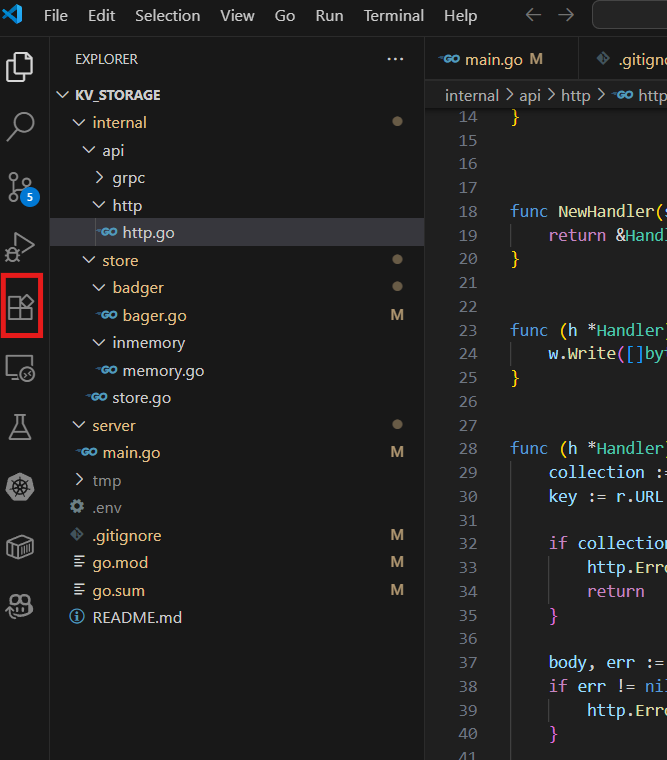
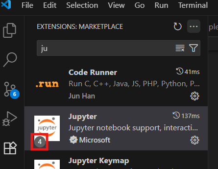
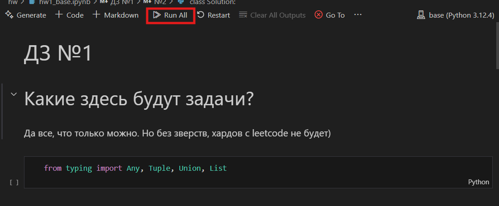
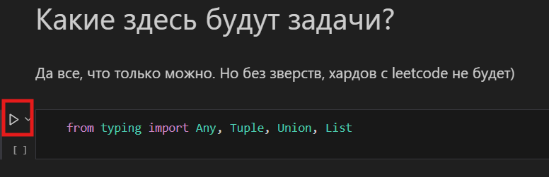

# Курс по Python для профиля информатики 2025-2026

## 🧐О чем это все?

Данный курс создан для развития навыков программирования в целом и ознакомления с синткасисом языка **Python**. Все что рассматривается в рамках курса возможно пригодится вам не только на **ЕГЭ**, но и на первом - втором курсе ВУЗа.

## ⚙️Использование

Все материалы представлены в формате `.ipynb` файлов. Работа с этими файлами отличается от привычной работы с `.py` файлами: здесь все запускается в отдельных клетках. Клетки `ЗАВИСЯТ` друг от друга! Но запускаются по отдельности (или все вместе, но по очереди), с отдельными output'ами.

### Запуск клеток

1. Чтобы нормально открыть `jupiter-notebook` (.ipynb формат - его) нужно установить пакет расширений в VSCode. Для этого слева, среди иконок выбираем `Extesions`:

Затем находим пакет расширений jupiter и устанавливаем его:

2. Открываем файл и идем запускать все клетки разом:

3. Запускам клетки по одной:

### Авторы
[hayasenna](https://github.com/hayasenna), [Dushnila](https://github.com/AnotherOneDushnila)
